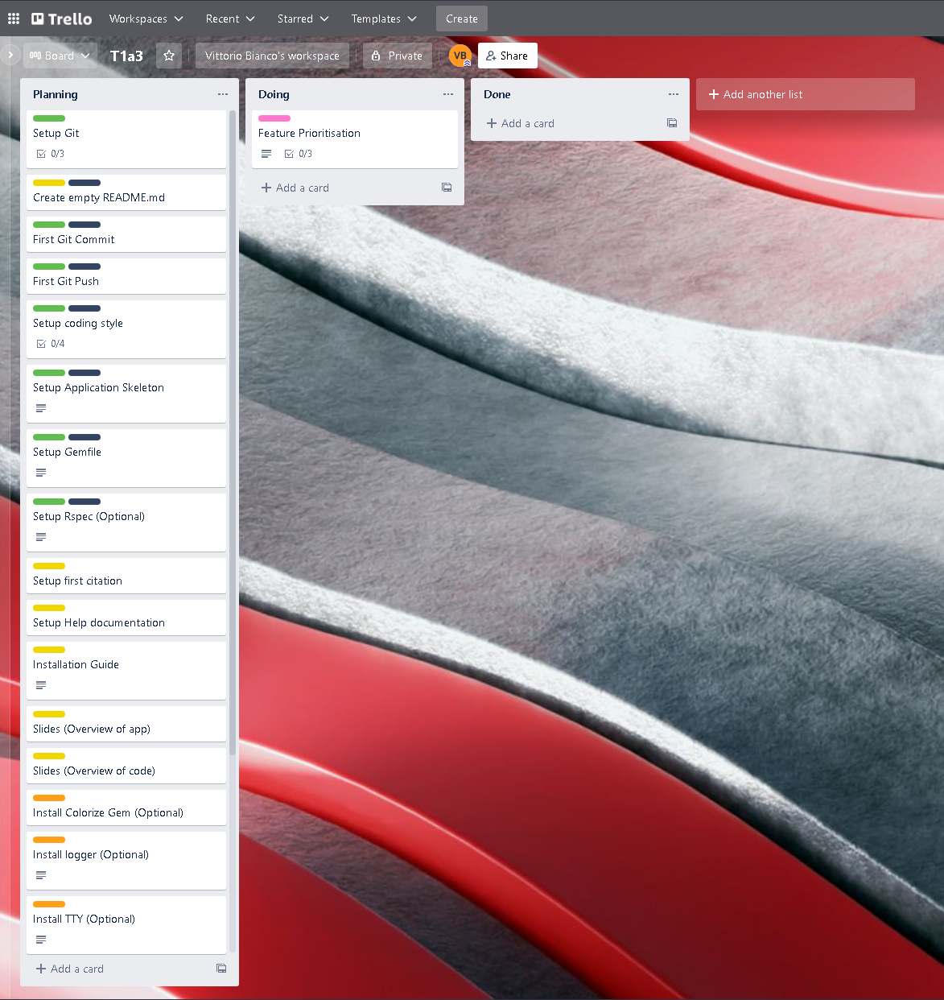
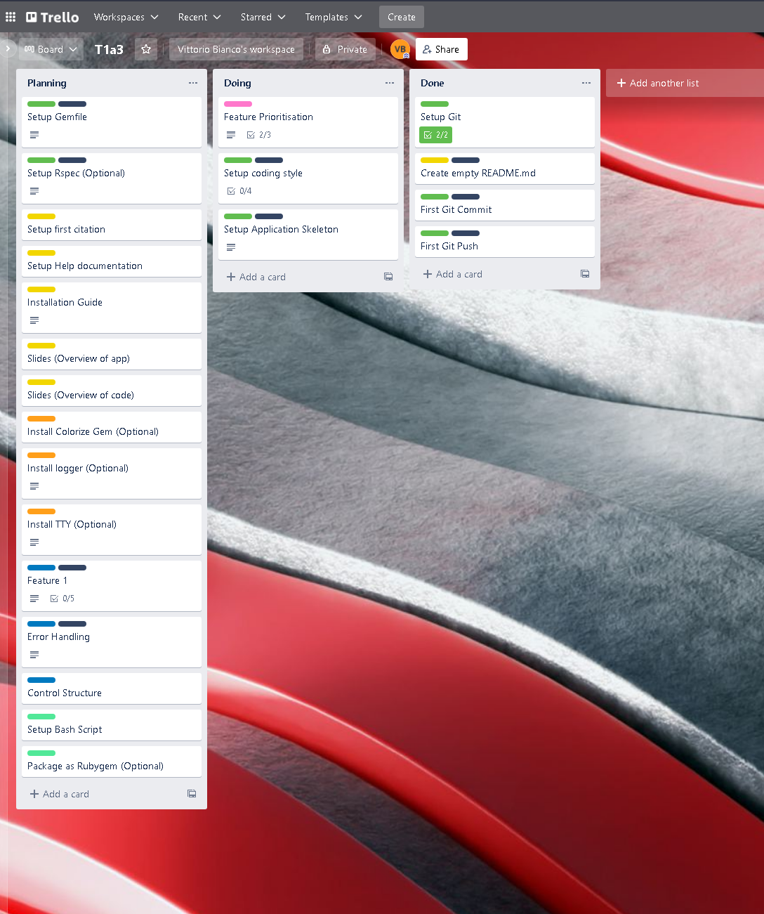
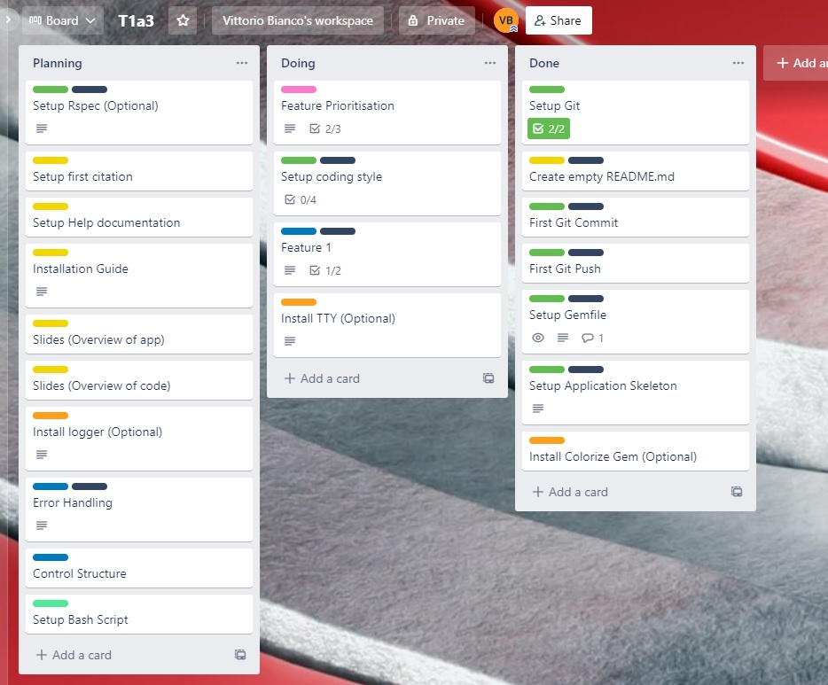
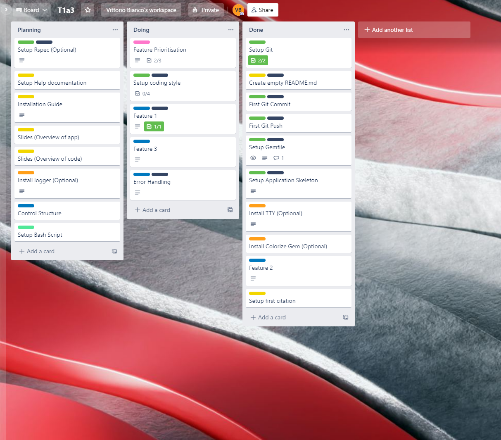
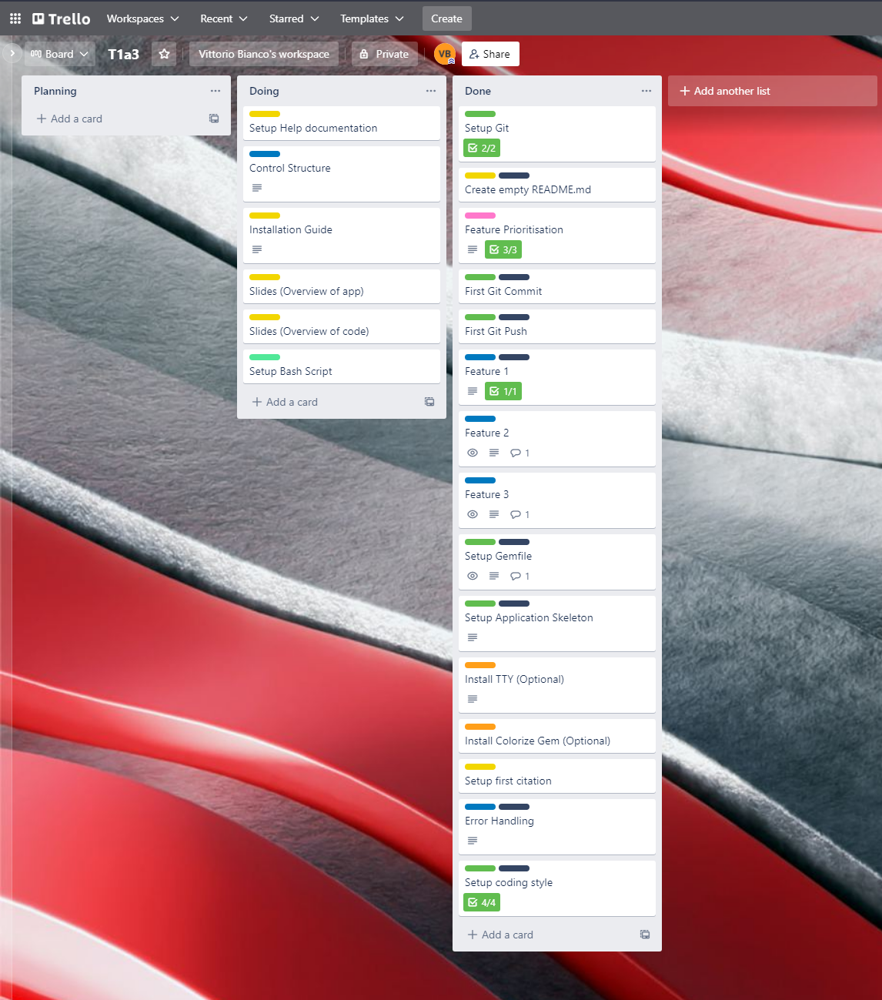
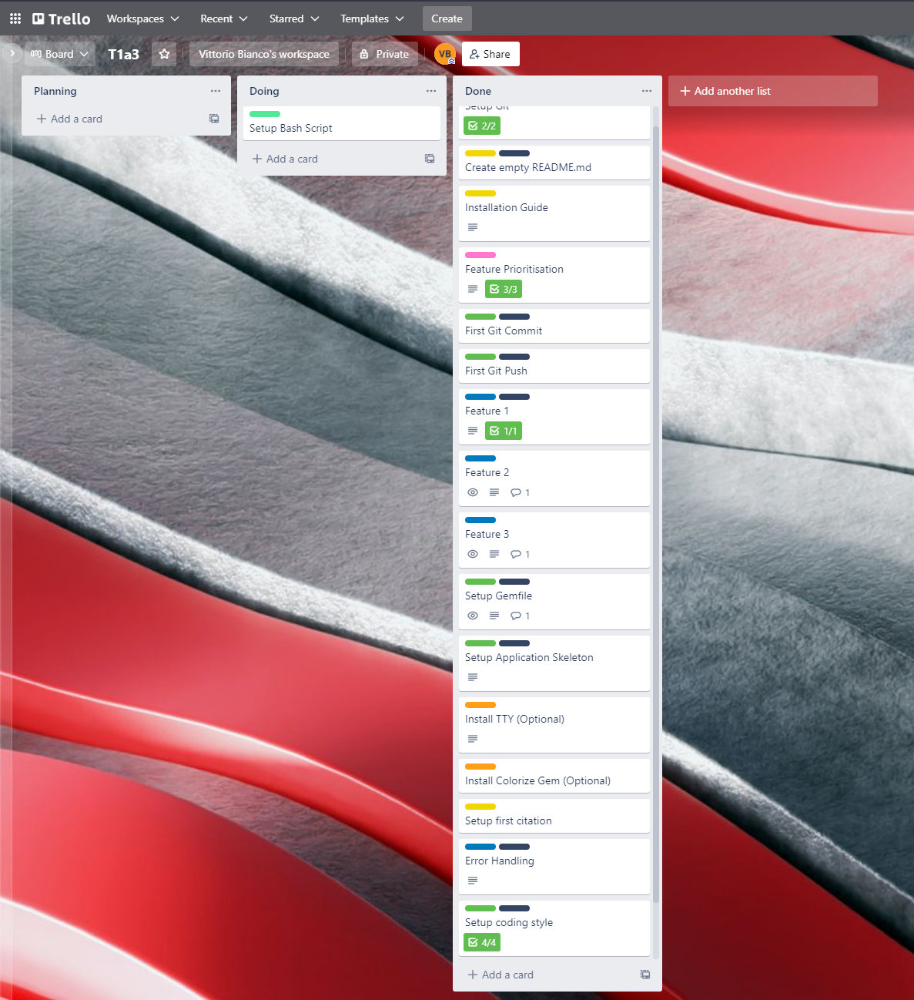

# **5x5 Trainer Terminal Application**

## **Install Guide**

### **Program Installation**
From the console, enter ./run_app.sh

### **Gem Installation**

#### **TTY-Prompt**

From the console enter:

- *gem 'tty-prompt'*
- *gem install 'tty-prompt'*
#### **Colorize**
From the console enter:

- *gem 'colorize'*
- *gem install 'colorize'*

## **Features**

### **Feature 1**

The 5x5 Workout Terminal Application features a Menu system made by using the Ruby Gem TTY Prompt in a Loop.  It also contains if/else statements which correlate to the menu options, for example if the user chooses the first menu option depicted by a number one and the descriptor it will print a brief summary of the 5x5 workout regiment.

### **Feature 2**

The second feature the application has is it is able to read external text files and print their contents to the screen.  Variables are used to link a File.read function where the argument points to the assosciated text files and their directory.

### **Feature 3**

The third feature that the application has is the ability for users to log their workouts and view them.  When the user selects the menu option to log a workout they will see a printed message asking them which exercises they would like to log along with a short list of the applicable exercises in the 5x5 regiment.  The user types in their exercise which is taken with a variable "gets".  They then see another printed question asking them how many sets of the excercise they performed which again is recieved as a variable "gets" with to_i(nteger) type coercion.
Finally, the input is pushed to an empty array as a interpolated string along with a date.
This feature is wrapped side of a method / function.

### Project Source Repository

[T1A3 Terminal Application Github](https://github.com/VittorioBianco/VittorioBianco_T1A3)

### Coding Style
The coding style was applied via Rubocop.
- 

- 

## **Trello**

## **Reference Citation**

#### **5x5 workout regiment**
- Article title:	5x5 Workout Program - The Ultimate Guide (2021)
- Website title:	Hevy - #1 Workout Tracker & Planner Gym Log App
- [URL](Https://www.hevyapp.com/5x5-workout/)
#### **Style guidance**
- Article title:	Ruby Style Guide
- Website title:	Ruby-style-guide.shopify.dev
- [URL](https://ruby-style-guide.shopify.dev/)

#### **Use of TTY Prompt**
- Article title:	File: README — Documentation for tty-prompt (0.23.1)
- Website title:	Rubydoc.info
- [README — Documentation for tty-prompt (0.23.1)](https://www.rubydoc.info/gems/tty-prompt)

- Article title:	colorize | RubyGems.org | your community gem host
- Website title:	Rubygems.org
- [colorize | RubyGems.org | your community gem host](https://rubygems.org/gems/colorize/versions/0.8.1)

